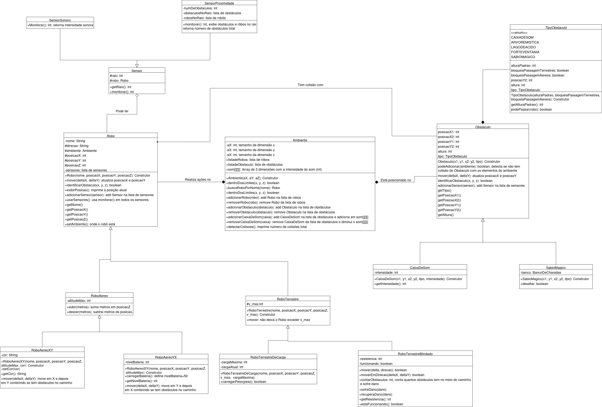

# MC-AC_MC322
Ana Carolina Vieira Araújo (248734)
Maria Clara Martinez Oliveira (281315)

*Ambiente de Desenvolvimento*

    IDE usada: Visual Studio Code

    Versão do Java: OpenJDK 21.0.6

*Sobre*

📜  Estrutura do Projeto

    O código simula um ambiente onde diferentes tipos de robôs (terrestres e aéreos) podem se mover, interagir e realizar tarefas, como carregar peso ou recarregar a bateria. O ambiente possui limites e obstáculos, e o comportamento dos robôs é condicionado por esses fatores.

    Robôs

        Robo: Classe base para todos os robôs. (Nome, velocidade, posição, interações básicas).

        Terrestres: 

        RoboTerrestreBlindado: Resistência especial a obstáculos, pode atravessar obstáculos que impediriam outros robôs. 
                               Podemos apenas mover uma direção de cada vez.

        RoboTerrestreDeCarga: Robô terrestre capaz de transportar cargas.
                              Possui atributos:

                              cargaMaxima: peso máximo que pode carregar.
                              cargaAtual: peso atualmente carregado.

        Aéreos:

        RoboAereoXY: Se movimenta primeiro no eixo X depois no eixo Y
                     Atributo: Cor

        RoboAereoYX: Se movimenta no eixo Y depois no eixo X
                     Atributo: Bateria

    Sensores

        Sensor: Classe genérica para sensores.

        SensorProximidade: Função: Detecta a presença de obstáculos e outros robôs dentro do seu raio de alcance.
                           Comportamento:

                           Varre o ambiente, verificando se há obstáculos dentro de uma distância "raio" em todas as direções (x, y, z).

                           Adiciona à sua lista:
                           Obstáculos encontrados.
                           Robôs encontrados próximos (em posições próximas ao robô monitorado).

                           Métodos importantes:
                           existenciaObstaculos(): Realiza a busca por obstáculos e robôs.
                           exibirObstaculosProximos(): Imprime os resultados encontrados.

        
        SensorSonoro: Mede a intensidade de som no ambiente criado pela CaixaDeSom
                      Função: Mede a intensidade do som no ambiente na posição atual do robô.

                      Comportamento:
                      Consulta o valor de som armazenado na matriz tridimensional do ambiente (som[x][y][z]).
                      Imprime no console o valor da intensidade sonora detectada.

                      Métodos importantes:
                      monitorar(): Retorna a intensidade de som na posição atual do robô.

    Obstáculos

        Obstaculo: Classe base para definir áreas bloqueadas ou interativas.

        SabioMagico: Obstáculo especial que desafia o jogador com charadas. O bloqueio ou não do caminho está condicionado ao acerto da charada.

        CaixaDeSom: Emite som com intensidade que decai ao se afastar e é identificado pelo sensor sonoro.

        TipoObstaculo: Enumeração que define o tipo e comportamento dos obstáculos.

        BancoDeCharadas e Charada: Banco de perguntas usadas pelo Sábio Mágico.

*Como Compilar e Executar:*

*Compilação*

    Compile todos os arquivos .java:
    javac *.java

    ou compile o Main.java diretamente (se ele importar os outros corretamente):
    javac Main.java

*Execução*

    Execute o programa no terminal:
    java Main

    Certifique-se de estar no diretório correto onde estão os arquivos .java compilados.

*Diagrama de Classes*
